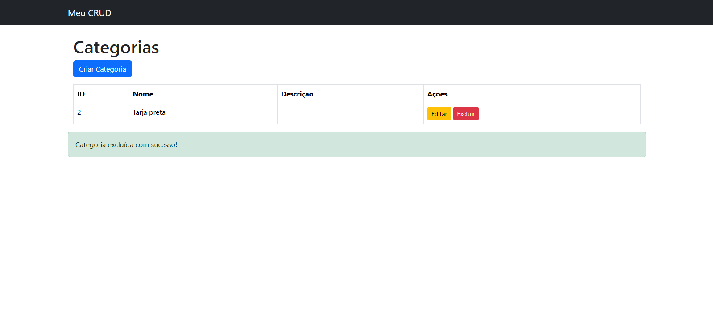
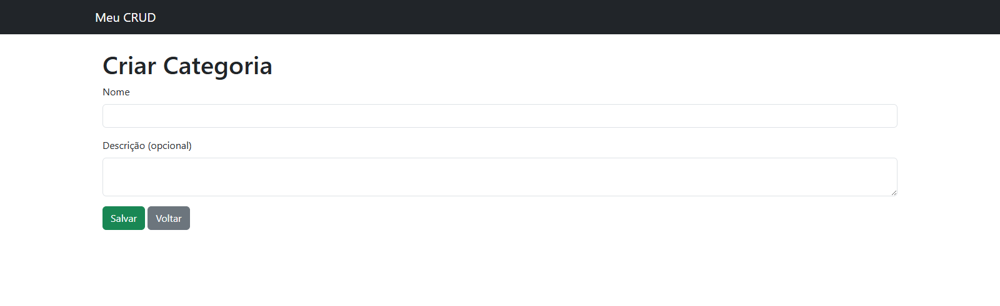
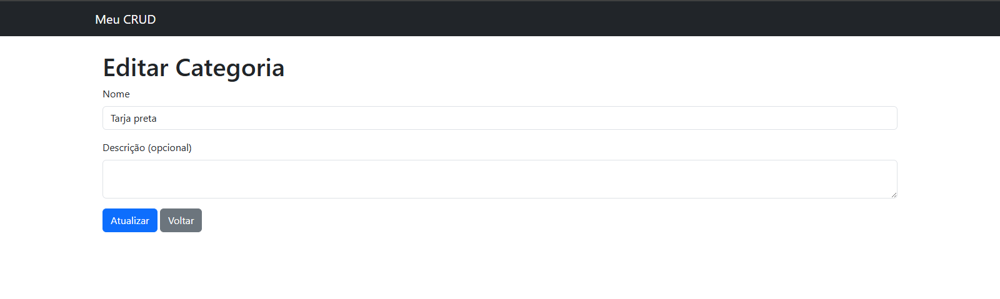
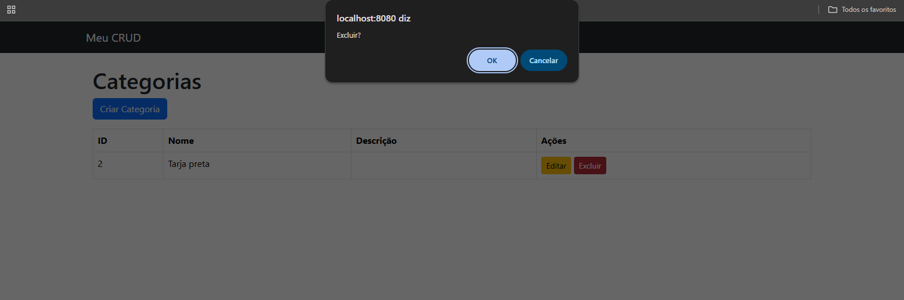
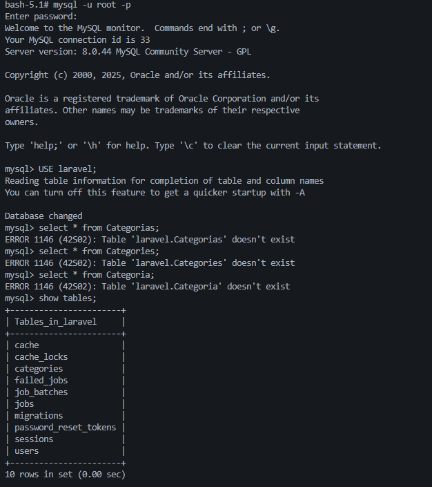

# 📦 Laravel CRUD com Docker


Este projeto é um **CRUD de Categorias** desenvolvido em **Laravel** rodando dentro de um ambiente totalmente **dockerizado**.

---

## 🚀 Tecnologias utilizadas

* **PHP 8.2**
* **Laravel 12**
* **MySQL 8**
* **Nginx (via Docker)**
* **Docker & Docker Compose**

---

## 🧪 Como testar o projeto

### 1️⃣ Subir o ambiente Docker

```bash
docker compose up -d --build
```

### 2️⃣ Acessar o container da aplicação

```bash
docker compose exec app bash
```

### 3️⃣ Instalar dependências

```bash
composer install
```

### 4️⃣ Copiar arquivo .env

```bash
cp .env.example .env
```

### 5️⃣ Gerar chave da aplicação

```bash
php artisan key:generate
```

### 6️⃣ Rodar migrações

```bash
php artisan migrate
```

### 7️⃣ Acessar o CRUD no navegador

```
http://localhost:8080/categories
```

---

## 🖼️ Prints do CRUD

### 📄 Lista de Categorias



### ➕ Criar Categoria



### ✏️ Editar Categoria



### ❌ Deletar Categoria



---

---

# 🧪 Testando o Banco de Dados no Docker (MySQL)

Depois de subir o ambiente com:

```bash
docker-compose up -d
```

Execute os seguintes comandos:

1. bash ``` docker exec -it laravel_mysql bash ```
2. bash``` mysql -u root -p ``` 
3. preencha a senha com bash ``` root ```
4. bash ``` SELECT * FROM categories``` para ver as categorias e suas respectivas informações

OBS: A partir do passo 3, basta utilizar comandos SQL para realizar operações e consultar dados.



## 👨‍💻 Autor

Feito por **Daniel Cardoso** — totalmente dockerizado e funcional.
